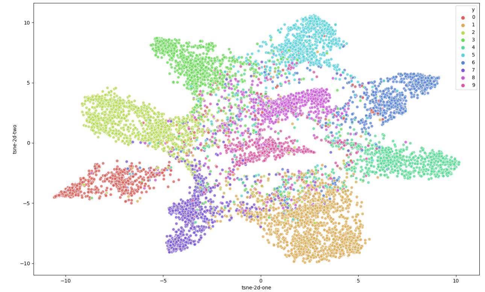

# Unsupervised Domain Adaptation for number classification using MNIST and SVHN datasets

This is a project part of the course "Deep Learning and Computer Vision" of National Taiwan University, and personally modified by me to make it an individual github project. 
In the second half of the PDF file you can see more information on the segmentation and models used and a visual representation of said segmentation.

This project contains the model of DANN for classifying digit images from different domains. We first train the model on the MNIST dataset and try it on the SVHN one and then the opposite, always trying to maximize the accuracy on the testing model.

The first model is a DANN and the second improved one uses Associative Domain Adaptation models to better train the model using only the other dataset. The accuracy on the improvel model should reach up to 73% on the MNIST dataset.

### Dataset
In the starter code of this repository, we have provided a shell script for downloading and extracting the dataset for this assignment. For Linux users, simply use the following command.

    bash ./get_dataset.sh
The shell script will automatically download the dataset and store the data in a folder called `hw3_data`. Note that this command by default only works on Linux. If you are using other operating systems, you should download the dataset from [this link](https://www.dropbox.com/s/65qdt9rkt808an4/hw3_data.zip) and unzip the compressed file manually.

To run the code use the following commands:

	CUDA_VISIBLE_DEVICES=GPU_NUMBER bash ./hw3_p3.sh $2 $3 $4
    CUDA_VISIBLE_DEVICES=GPU_NUMBER bash ./hw3_p4.sh $2 $3 $4

-   `$2` is the directory of testing images in the **target** domain (e.g. `hw3_data/digits/svhn/test`).
-   `$3` is a string that indicates the name of the target domain, which will be either `mnistm` or `svhn`. 
	- Note that you should run the model whose *target* domain corresponds with `$3`. For example, when `$3` is `svhn`, you should make your prediction using your "mnistm→svhn" model, **NOT** your "svhn→mnistm→" model.
-   `$4` is the path to your output prediction file (e.g. `hw3_data/digits/svhn/test_pred.csv`).

### Image Segmentation in 2D in the improved model

